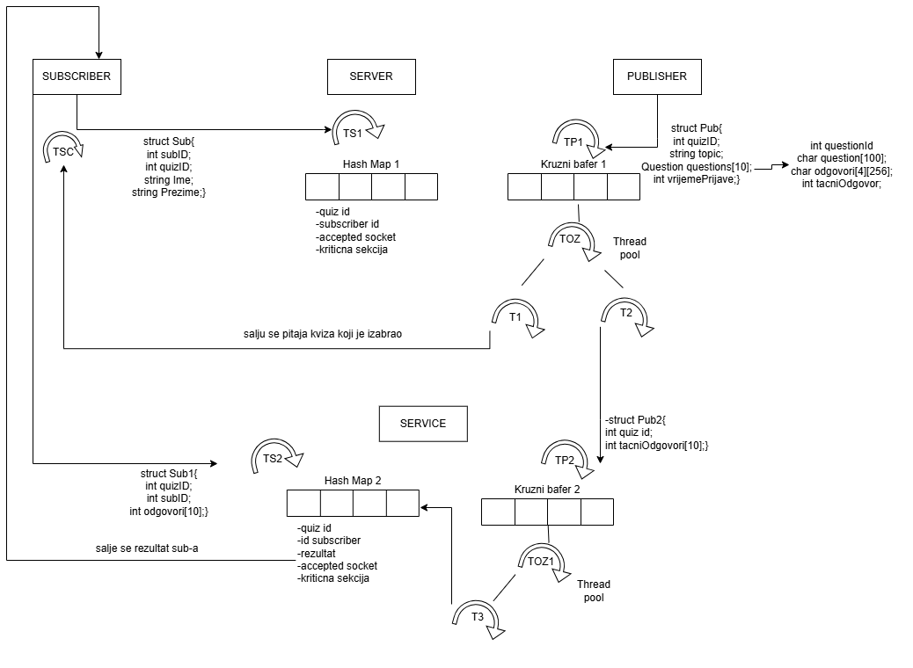

# Publisher and Subscriber quiz
Theme of this project is quiz system,where subscriber connect on the server choose one of the available quizes and answer questions by entering a number from 1 to 4.
The system consists of a publisher,subscriber,server and service for calculating score.The goal of this project is to learn how to work with threads,sockets and how to 
create complex data structures(hash map,circular buffer,...).The project is implemented using the C++ programming language and the Visual Studio development environment.

## Design
Visual representation of the system architecture,showing main components,data flow and how the system communicates

## Start the project
To start the quiz with multiple subscribers and publishers,follow instructions below:

  1. Downolad thie ZIP archive or clone repository using the Web URL
  2. Open the soultion in Visual Studio ( `.sln` file)
  3. Build the solution to create `.exe` files
  4. Open Windows Terminal in the folder,where is the `run_project.bat` file
  5. Run the command: `.\run_project.bat`.   

The quiz with multiple subscribers and publishers will start

## Contributors
  - Aleksa Arsenić (github : [aleksa1508](https://github.com/aleksa1508))
  - Božana Todorović (github : [BozanaTodorovic](https://github.com/BozanaTodorovic))
